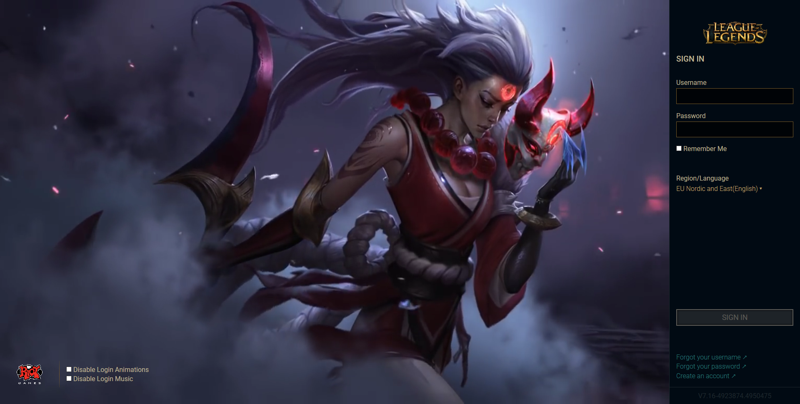

# League of Legends Client
Web version of league of legends game client.

Made with [hextech style guide](http://nexus.leagueoflegends.com/2016/12/the-visual-language-of-hextech/) in mind.

## Assets

### Login Screens
* [Blood Moon Diana](https://www.youtube.com/watch?v=myEKQkKdKtQ)
* [Bit Rush: Arcade Ahri](https://www.youtube.com/watch?v=DYW-kEiCnJI)

### Fonts
* [Roboto](https://fonts.google.com/specimen/Roboto)

### Logos
* [Riot](https://www.riotgames.com/sites/default/files/asset-kit-assets/files/Riot_logo_WHITE_TEXT.png)
* [League of Legends](https://www.riotgames.com/sites/default/files/asset-kit-assets/files/LOL_LOGO_RGB_SMALL%20copy.PNG)

## License
This project is licensed under the MIT License - see the [LICENSE](LICENSE) file for details.
