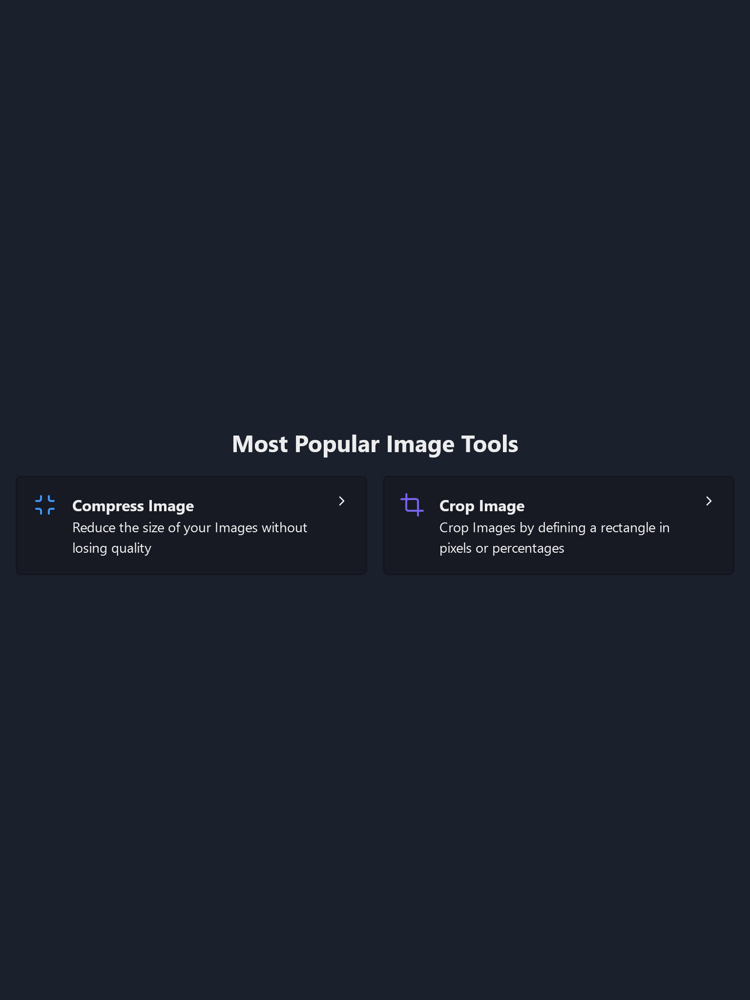

# Tenet

[](https://github.com/prettier/prettier)
[](https://github.com/malcodeman/tenet/blob/master/LICENSE)

A non-profit organization.



## Getting started

```
git clone https://github.com/malcodeman/tenet.git tenet
cd tenet
yarn install && yarn develop
```

## License

[MIT](./LICENSE)
